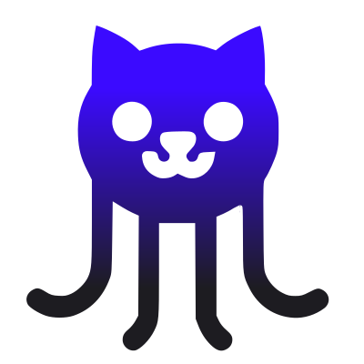

<div align="center">
  
  
  # Gules - Complete Jules AI Toolkit
  
  > A comprehensive Rust toolkit for [Jules AI](https://jules.google.com) - the autonomous coding agent. Pure SDK, CLI tools, and MCP server in one modular ecosystem.
</div>

[](LICENSE)
[](https://modelcontextprotocol.io)
[](https://www.rust-lang.org)

---

## ✨ What is Gules?

**Gules** provides three ways to interact with Jules AI:

1. **🔧 SDK** (`jules-rs`) - Pure 1:1 Rust SDK for Jules API (independently publishable)
2. **💻 CLI** (`jules-cli` / `gules`) - Command-line interface with extended features
3. **🔌 MCP** (`jules-mcp`) - Model Context Protocol server for AI assistants

All components implement **100% pure 1:1 SDK mapping** - every Jules API method is available.

---

## 🚀 Quick Start

### Build Options

Gules uses **feature flags** to let you build exactly what you need:

```bash
# CLI only (default) - Extended CLI, no MCP
cargo build -p gules

# CLI + Basic MCP - Extended CLI + 9 SDK MCP tools
cargo build -p gules --features mcp

# CLI + Extended MCP - Extended CLI + 11 MCP tools (SDK + extended)
cargo build -p gules --features extended-mcp

# Pure SDK CLI - Minimal, 9 core commands only
cargo build -p jules-cli

# Pure SDK MCP - Independently usable MCP server
cargo build -p jules-mcp
```

**See [FEATURE_FLAGS.md](docs/FEATURE_FLAGS.md) for complete details.**

### Installation

```bash
# From source (requires Rust 1.70+)
git clone https://github.com/kiwina/gules
cd gules

# Install with extended MCP support (recommended)
cargo install --path crates/gules --features extended-mcp

# Or CLI-only (faster build, smaller binary)
cargo install --path crates/gules

# Verify installation
gules --version
```

### Configuration

Create `~/.config/gules/config.toml`:

```toml
api_key = "your-jules-api-key-here"
```

Get your API key from [jules.google.com/settings](https://jules.google.com/settings)

### First Session

```bash
# Create a Jules session
gules create "Fix the authentication bug" --source "sources/github/owner/repo"

# Watch progress
gules watch <session-id>

# Check status
gules session <session-id>
```

---

## 📦 Project Structure

This workspace contains multiple crates for different use cases:

```
gules/
├── crates/
│   ├── jules-rs/        # Pure Jules API SDK (9 methods, 100% coverage)
│   ├── jules-core/      # Shared utilities (config, display)
│   ├── jules-cli/       # Basic CLI commands (9 pure SDK commands)
│   ├── jules-mcp/       # MCP server (9 SDK tools + 2 extended)
│   └── gules/           # Extended CLI (all features + conveniences)
└── tests/               # Integration tests
```

### Architecture Principle

```
jules-rs   → Pure 1:1 SDK (10 API methods, independently publishable)
  ↓
jules-cli  → Pure SDK exposure (13 commands)
  ↓
jules-mcp  → Pure SDK MCP server (9 tools)
  ↓
gules      → Extended features (17 commands, or 11 MCP tools with extended-mcp)
```

---

## 💻 CLI Usage

### Core Commands (13 from jules-cli)

```bash
# Session Management
gules sessions [--state STATE] [--limit N]     # List sessions
gules session <SESSION_ID>                     # Get session details
gules active [--limit N]                       # List active sessions
gules completed [--limit N]                    # List completed sessions
gules failed [--limit N]                       # List failed sessions
gules create <PROMPT> --source <SOURCE>        # Create session
gules send-message <SESSION_ID> <MESSAGE>      # Send message
gules approve-plan <SESSION_ID>                # Approve plan

# Source Management
gules sources [--filter FILTER] [--limit N]    # List sources
gules source <SOURCE_ID>                       # Get source details

# Activity Management
gules activities <SESSION_ID> [--limit N]      # List activities
gules activity <SESSION_ID> <ACTIVITY_ID>      # Get activity details

# Configuration
gules config show                              # Show config
gules config init                              # Initialize config
gules config set <KEY> <VALUE>                 # Set config value
gules activity <SESSION_ID> <ACTIVITY_ID>      # Get activity
```

### Extended Features

```bash
# Convenience Filters
gules active              # Show active sessions
gules completed           # Show completed sessions
gules failed              # Show failed sessions

# Monitoring
gules watch <SESSION_ID>  # Monitor session until complete
gules monitor             # Monitor all active sessions

# GitHub Integration (requires gh CLI)
gules issue-status <ISSUE> --owner <OWNER> --repo <REPO>
gules pr-status <SESSION_ID>
```

---

## 🔌 MCP Server Mode

Run gules as an MCP server for AI assistants like Claude Desktop or VS Code Copilot:

```bash
gules --mcp
```

### Available MCP Tools (11 total)

**Pure SDK Tools (9)**:
- `create_session` - Create new Jules session
- `get_session` - Get session details
- `list_sessions` - List all sessions
- `send_message` - Send message to session
- `approve_plan` - Approve session plan
- `list_sources` - List available sources
- `get_source` - Get source details
- `list_activities` - List session activities
- `get_activity` - Get activity details

**Extended Tools (2)**:
- `watch_session` - Monitor session until completion
- `issue_status` - Check GitHub issue status

### Claude Desktop Configuration

Add to `~/Library/Application Support/Claude/claude_desktop_config.json`:

```json
{
  "mcpServers": {
    "gules": {
      "command": "/path/to/gules",
      "args": ["--mcp"],
      "env": {
        "JULES_API_KEY": "your-api-key-here"
      }
    }
  }
}
```

See [docs/MCP.md](docs/MCP.md) for complete MCP setup guide.

---

## �� SDK Usage (jules-rs)

Use `jules-rs` in your Rust projects:

```rust
use jules_rs::JulesClient;

#[tokio::main]
async fn main() -> anyhow::Result<()> {
    // Create client
    let client = JulesClient::new("your-api-key");
    
    // List sessions
    let response = client.list_sessions(Some(10), None).await?;
    println!("Found {} sessions", response.sessions.len());
    
    // Get session details
    let session = client.get_session("session-id").await?;
    println!("Session state: {:?}", session.state);
    
    // Create new session
    let request = CreateSessionRequest {
        prompt: "Fix authentication bug".to_string(),
        source_context: SourceContext {
            source: "sources/github/owner/repo".to_string(),
            github_repo_context: Some(GitHubRepoContext {
                starting_branch: "main".to_string(),
            }),
        },
        title: Some("Fix auth bug".to_string()),
        require_plan_approval: None,
        automation_mode: None,
    };
    let session = client.create_session(request).await?;
    
    Ok(())
}
```

**SDK Features**:
- ✅ 100% Jules API coverage (9 methods)
- ✅ Pure 1:1 API mapping
- ✅ Type-safe with full Rust types
- ✅ Async/await with tokio
- ✅ Comprehensive error handling
- ✅ Independently publishable

---

## 📊 Coverage Status

| Component | SDK Coverage | Status |
|-----------|--------------|--------|
| jules-rs (SDK) | 9/9 (100%) | ✅ Complete |
| jules-cli | 9/9 (100%) | ✅ Complete |
| jules-mcp | 9/9 (100%) | ✅ Complete |
| gules (Extended) | 9/9 + extras | ✅ Complete |

**All layers implement 100% pure 1:1 SDK mapping!**

---

## 🛠️ Development

### Building from Source

```bash
# Clone repository
git clone https://github.com/kiwina/gules
cd gules

# Build all crates
cargo build --workspace

# Run tests
cargo test --all

# Build release
cargo build --release
```

### Running Tests

```bash
# Run all tests
cargo test --all

# Run specific crate tests
cargo test --package jules-rs
cargo test --package jules-cli
cargo test --package jules-mcp

# Run with verbose output
cargo test --all -- --nocapture
```

### Project Statistics

- **Total Tests**: 42 passing
- **Compilation**: Clean (0 errors, 0 warnings)
- **Code Coverage**: 100% SDK API coverage
- **Status**: Production ready ✅

---

## 📚 Documentation

### Main Documentation
- **[README.md](README.md)** - This file (project overview)
- **[CHANGELOG.md](CHANGELOG.md)** - Version history and changes
- **[AGENTS.md](AGENTS.md)** - AI agent development guide

### Command & Integration Guides
- **[docs/COMMANDS.md](docs/COMMANDS.md)** - Complete command reference
- **[docs/MCP.md](docs/MCP.md)** - MCP integration guide
- **[docs/CI.md](docs/CI.md)** - CI/CD guide

---

## 🤝 Contributing

Contributions welcome! Please:

1. Read the architecture principle (SDK = pure, CLI/MCP = pure exposure, gules = conveniences)
2. Ensure all tests pass: `cargo test --all`
3. Follow existing code patterns
4. Update documentation for new features

---

## 📜 License

Licensed under the MIT License. See [LICENSE](LICENSE) for details.

---

## 🔗 Links

- **Jules AI**: [jules.google.com](https://jules.google.com)
- **MCP Specification**: [modelcontextprotocol.io](https://modelcontextprotocol.io)
- **Repository**: [github.com/kiwina/gules](https://github.com/kiwina/gules)
- **Issues**: [github.com/kiwina/gules/issues](https://github.com/kiwina/gules/issues)

---

<p align="center">
  <i>Built with 💎 Rust • Powered by Jules AI • Compatible with MCP</i>
</p>

---

**Version**: 0.2.1  
**Status**: Production Ready ✅  
**Last Updated**: October 23, 2025
